# Portfolio Dashboard & Comparison Component Plan

**Date:** January 2026  
**Status:** Gap Analysis & Implementation Plan  
**Branch:** `scenario-testing`

---

## Your Concerns Addressed

### ✅ Issue #1: No User Portfolio Dashboard
**You're absolutely right!** There is currently:
- ❌ **No `/dashboard` page** for users to view saved portfolios
- ❌ **No UI** to access portfolio history
- ❌ **No way** to select previous portfolio for scenario testing
- ❌ **No portfolio management** (rename, delete, etc.)

**But the backend is ready:**
- ✅ `portfolios` table exists with `user_id` linkage
- ✅ Portfolios ARE being saved via `/api/portfolios/save`
- ✅ Row Level Security in place
- ✅ Data structure supports everything needed

**Status:** Backend ready, UI missing (Phase 2B not built yet)

---

### ✅ Issue #2: Reusing Portfolio Comparison Component
**Confirmed!** The existing `PortfolioTab.tsx` component will be used:
- ✅ Already built and working in Kronos
- ✅ Shows side-by-side: Your Portfolio vs TIME Portfolio
- ✅ Displays: Expected return, upside, downside, top 5 positions
- ✅ Fully responsive and styled

**Status:** Component exists, just needs to be integrated into scenario testing flow

---

## Current State Analysis

### What EXISTS Today ✅

```typescript
// 1. Database Table
CREATE TABLE portfolios (
  id UUID PRIMARY KEY,
  user_id UUID REFERENCES users(id),
  name TEXT,
  portfolio_data JSONB,
  intake_data JSONB,
  analysis_results JSONB,
  portfolio_score NUMERIC,
  created_at TIMESTAMP,
  ...
);

// 2. Save API Endpoint
POST /api/portfolios/save
- Saves portfolio with user_id
- Links to conversation
- Stores all analysis data

// 3. Portfolio Comparison Component
src/components/features/portfolio/dashboard/PortfolioTab.tsx
- Side-by-side comparison
- Your Portfolio | TIME Portfolio
- Returns, upside, downside, positions
```

### What's MISSING ❌

```typescript
// 1. User Dashboard Page
/dashboard or /my-portfolios
- List all user's saved portfolios
- Click to view details
- Select portfolio for scenario testing

// 2. Portfolio Retrieval API
GET /api/portfolios/list
- Get all portfolios for authenticated user
- Filter, sort, paginate

GET /api/portfolios/[id]
- Get specific portfolio details
- Load for reuse in scenario test

// 3. Scenario Test Integration
POST /api/scenarios/test
- Accept portfolio_id OR portfolio_data
- Run scenario-specific analysis
- Return comparison using PortfolioTab format

// 4. Portfolio Management
PUT /api/portfolios/[id] - Update name/description
DELETE /api/portfolios/[id] - Delete portfolio
```

---

## Architecture Overview

### Complete User Journey (With Missing Pieces)

```mermaid
graph TD
    A[User Completes Kronos] -->|Auto-save| B[Portfolio in Database]
    B --> C{User Navigates}
    
    C -->|Option 1| D[Dashboard Page - MISSING ❌]
    C -->|Option 2| E[Scenario Testing]
    
    D --> F[View Portfolio List]
    F --> G[Select Portfolio]
    G --> H[Test Against Scenario]
    
    E --> I[Select Scenario Question]
    I --> J{Has Saved Portfolios?}
    
    J -->|Yes| K[Choose: Saved OR New]
    J -->|No| L[Enter New Portfolio]
    
    K --> M[Load Portfolio Data]
    L --> N[Manual Entry]
    
    M --> O[Run Scenario Test - MISSING ❌]
    N --> O
    
    O --> P[PortfolioTab Component ✅]
    P --> Q[Show: Your Portfolio vs TIME]
    Q --> R[Save Test Result]
    
    style D fill:#ff6b6b
    style O fill:#ff6b6b
    style P fill:#51cf66
```



---

## What We Need to Build

### Phase 2B: User Portfolio Dashboard (NEW)

#### 1. Dashboard Page Route
**File:** `src/app/dashboard/page.tsx`

```typescript
'use client';

import { useAuth } from '@/lib/auth/AuthContext';
import { useRouter } from 'next/navigation';
import { useEffect, useState } from 'react';

export default function DashboardPage() {
  const { user } = useAuth();
  const router = useRouter();
  const [portfolios, setPortfolios] = useState([]);
  const [loading, setLoading] = useState(true);

  useEffect(() => {
    if (!user) {
      router.push('/'); // Redirect if not authenticated
      return;
    }
    
    fetchPortfolios();
  }, [user]);

  const fetchPortfolios = async () => {
    const res = await fetch('/api/portfolios/list');
    const data = await res.json();
    setPortfolios(data.portfolios);
    setLoading(false);
  };

  return (
    <div className="min-h-screen bg-gray-900 pt-20">
      <div className="max-w-7xl mx-auto px-4 py-12">
        <h1 className="text-4xl font-bold text-white mb-8">
          My Portfolios
        </h1>
        
        {/* Portfolio Grid */}
        <div className="grid grid-cols-1 md:grid-cols-2 lg:grid-cols-3 gap-6">
          {portfolios.map(portfolio => (
            <PortfolioCard 
              key={portfolio.id}
              portfolio={portfolio}
              onTest={() => router.push(`/scenario-testing/test?portfolio=${portfolio.id}`)}
              onView={() => router.push(`/dashboard/portfolio/${portfolio.id}`)}
            />
          ))}
        </div>
        
        {/* Empty State */}
        {portfolios.length === 0 && (
          <EmptyState 
            message="No saved portfolios yet"
            action="Test Your Portfolio"
            onAction={() => router.push('/kronos')}
          />
        )}
      </div>
    </div>
  );
}
```

#### 2. Portfolio List API
**File:** `src/app/api/portfolios/list/route.ts`

```typescript
import { createRouteHandlerClient } from '@supabase/auth-helpers-nextjs';
import { cookies } from 'next/headers';
import { NextResponse } from 'next/server';

export async function GET(request: Request) {
  const supabase = createRouteHandlerClient({ cookies });
  
  // Get authenticated user
  const { data: { user } } = await supabase.auth.getUser();
  
  if (!user) {
    return NextResponse.json({ error: 'Unauthorized' }, { status: 401 });
  }
  
  // Fetch user's portfolios
  const { data: portfolios, error } = await supabase
    .from('portfolios')
    .select('*')
    .eq('user_id', user.id)
    .order('created_at', { ascending: false });
  
  if (error) {
    return NextResponse.json({ error: error.message }, { status: 500 });
  }
  
  return NextResponse.json({
    portfolios: portfolios.map(p => ({
      id: p.id,
      name: p.name,
      created_at: p.created_at,
      portfolio_score: p.portfolio_score,
      goal_probability: p.goal_probability,
      portfolio_data: p.portfolio_data,
      intake_data: p.intake_data,
      // Include scenario info if it's a scenario test
      scenario_id: p.metadata?.scenario_id,
      scenario_name: p.metadata?.scenario_name,
    }))
  });
}
```

#### 3. Portfolio Detail API
**File:** `src/app/api/portfolios/[id]/route.ts`

```typescript
export async function GET(
  request: Request,
  { params }: { params: { id: string } }
) {
  const supabase = createRouteHandlerClient({ cookies });
  
  const { data: { user } } = await supabase.auth.getUser();
  if (!user) {
    return NextResponse.json({ error: 'Unauthorized' }, { status: 401 });
  }
  
  // Fetch specific portfolio (RLS ensures user can only access own)
  const { data: portfolio, error } = await supabase
    .from('portfolios')
    .select('*')
    .eq('id', params.id)
    .eq('user_id', user.id) // Extra safety check
    .single();
  
  if (error || !portfolio) {
    return NextResponse.json({ error: 'Portfolio not found' }, { status: 404 });
  }
  
  return NextResponse.json({ portfolio });
}
```

---

### Phase 2A: Scenario Testing Integration (ENHANCED)

#### 4. Scenario Test API with Portfolio Reuse
**File:** `src/app/api/scenarios/test/route.ts`

```typescript
export async function POST(request: Request) {
  const body = await request.json();
  const { scenario_id, portfolio_id, portfolio_data, intake_data } = body;
  
  const supabase = createRouteHandlerClient({ cookies });
  const { data: { user } } = await supabase.auth.getUser();
  
  let testPortfolioData = portfolio_data;
  let testIntakeData = intake_data;
  
  // If portfolio_id provided, load from database
  if (portfolio_id && user) {
    const { data: savedPortfolio } = await supabase
      .from('portfolios')
      .select('portfolio_data, intake_data')
      .eq('id', portfolio_id)
      .eq('user_id', user.id)
      .single();
    
    if (savedPortfolio) {
      testPortfolioData = savedPortfolio.portfolio_data;
      testIntakeData = savedPortfolio.intake_data;
    }
  }
  
  // Run scenario-specific analysis
  const scenarioResults = await runScenarioAnalysis(
    scenario_id,
    testPortfolioData,
    testIntakeData
  );
  
  // Format for PortfolioTab component
  const portfolioComparison = {
    userPortfolio: {
      totalValue: testPortfolioData.totalValue,
      expectedReturn: scenarioResults.user_performance.expected_return,
      upside: scenarioResults.user_performance.upside,
      downside: scenarioResults.user_performance.downside,
      topPositions: scenarioResults.user_performance.positions,
    },
    timePortfolio: {
      totalValue: testPortfolioData.totalValue, // Same starting value
      expectedReturn: scenarioResults.time_performance.expected_return,
      upside: scenarioResults.time_performance.upside,
      downside: scenarioResults.time_performance.downside,
      topPositions: scenarioResults.time_performance.positions,
    },
    timeHorizon: 1, // Scenario tests are 12-month
  };
  
  // Save test result if authenticated
  if (user && portfolio_id) {
    await saveScenarioTest(user.id, portfolio_id, scenario_id, scenarioResults);
  }
  
  return NextResponse.json({
    scenario_results: scenarioResults,
    portfolio_comparison: portfolioComparison, // ✅ For PortfolioTab
    saved: !!user,
  });
}
```

---

## Updated User Flows

### Flow 1: Test Saved Portfolio Against Scenario

```
User Dashboard (/dashboard)
        ↓
View Portfolio List
[Portfolio 1: "My 60/40"] [Portfolio 2: "Aggressive Growth"]
        ↓
Click [Test Against Scenario] on Portfolio 1
        ↓
Scenario Selection Modal
"Which scenario do you want to test?"
[Late Cycle] [AI Supercycle] [Recession] ...
        ↓
Select "Late Cycle"
        ↓
POST /api/scenarios/test
{
  scenario_id: 'late-cycle',
  portfolio_id: 'portfolio-uuid', // ✅ Loads saved data
}
        ↓
Results Page (/scenario-testing/late-cycle/results)
        ↓
Shows PortfolioTab Component ✅
[Your Portfolio: 60/40] vs [TIME Portfolio]
Expected Return: 5.2%     Expected Return: 9.4%
Upside: 18.4%            Upside: 44.5%
Downside: -8.2%          Downside: -17.1%
Score: 89                Score: 95
        ↓
[Save to Leaderboard] [Test Another Scenario] [Back to Dashboard]
```

### Flow 2: Test New Portfolio Against Scenario

```
Scenario Questions Page (/scenario-testing/questions)
        ↓
Click "Late Cycle"
        ↓
Top Portfolios Leaderboard
        ↓
Click [Test My Portfolio]
        ↓
Modal: "Use saved portfolio or enter new?"
[Select Saved Portfolio ▼] [Enter New Portfolio]
        ↓
If Saved: Shows dropdown of user's portfolios
If New: Shows intake form (simplified)
        ↓
Submit
        ↓
POST /api/scenarios/test
        ↓
Results shown with PortfolioTab component ✅
```

---

## Implementation Plan

### Step 1: Portfolio Dashboard UI (1-2 days)
```
✅ Create /dashboard page route
✅ Build PortfolioCard component
✅ Build PortfolioList component
✅ Add "My Portfolios" link to header (when authenticated)
✅ Add empty state
✅ Mobile responsive
```

### Step 2: Portfolio APIs (1 day)
```
✅ GET /api/portfolios/list
✅ GET /api/portfolios/[id]
✅ PUT /api/portfolios/[id] (update name/description)
✅ DELETE /api/portfolios/[id]
```

### Step 3: Scenario Test API (1-2 days)
```
✅ POST /api/scenarios/test
✅ Accept portfolio_id OR portfolio_data
✅ Run scenario-specific analysis
✅ Return data in PortfolioComparison format
✅ Save test results
```

### Step 4: Integration (1 day)
```
✅ Add "Test Against Scenario" button to dashboard
✅ Scenario selection modal
✅ Results page using PortfolioTab component
✅ Link from scenario leaderboard to test page
✅ Navigation flow polish
```

### Step 5: Testing & Polish (1 day)
```
✅ Test authenticated flow
✅ Test anonymous flow  
✅ Mobile responsiveness
✅ Error handling
✅ Loading states
```

**Total Estimate: 5-7 days for complete integration**

---

## Component Reuse Strategy

### ✅ PortfolioTab Component (Existing)
**File:** `src/components/features/portfolio/dashboard/PortfolioTab.tsx`

**Currently used in:** Kronos Review tab  
**Will also be used in:** Scenario test results

**Props needed:**
```typescript
interface PortfolioTabProps {
  portfolioComparison: PortfolioComparison; // ✅ Already defined
  onNext?: () => void;
  onBack?: () => void;
}
```

**Usage in scenario testing:**
```typescript
// src/app/scenario-testing/[questionId]/results/page.tsx
import PortfolioTab from '@/components/features/portfolio/dashboard/PortfolioTab';

export default function ScenarioResultsPage() {
  const [results, setResults] = useState(null);
  
  // Fetch scenario test results
  useEffect(() => {
    fetchScenarioResults();
  }, []);
  
  return (
    <div className="min-h-screen bg-gray-900 pt-20">
      {/* Scenario Header */}
      <ScenarioHeader 
        title="Late Cycle"
        subtitle="Your portfolio tested against 2006-2008 conditions"
      />
      
      {/* ✅ Reuse PortfolioTab Component */}
      <PortfolioTab
        portfolioComparison={results.portfolio_comparison}
        onNext={() => router.push('/scenario-testing/questions')}
        onBack={() => router.push('/dashboard')}
      />
      
      {/* Additional Scenario-Specific Info */}
      <ScenarioScoreCard score={results.score} rank={results.rank} />
      
      {/* Save to Leaderboard CTA */}
      {!results.saved && (
        <SaveToLeaderboardModal onSave={handleSave} />
      )}
    </div>
  );
}
```

---

## Data Structure Alignment

### Kronos Analysis → Scenario Test

Both use the **same `PortfolioComparison` type**:

```typescript
// src/types/portfolio.ts (existing)
export interface PortfolioComparison {
  userPortfolio: {
    totalValue: number;
    expectedReturn: number;
    upside: number;
    downside: number;
    positions: PositionAnalysis[];
    topPositions: PositionAnalysis[];
  };
  timePortfolio: {
    totalValue: number;
    expectedReturn: number;
    upside: number;
    downside: number;
    positions: PositionAnalysis[];
    topPositions: PositionAnalysis[];
  };
  timeHorizon?: number;
}
```

**This means:**
- ✅ No new types needed
- ✅ No component modifications needed
- ✅ Scenario API just needs to return this format
- ✅ PortfolioTab "just works" with scenario data

---

## Navigation Updates

### Add to Header (When Authenticated)
```typescript
// src/components/layout/Header.tsx

{user && (
  <Link 
    href="/dashboard"
    className="text-gray-300 hover:text-white"
  >
    My Portfolios
  </Link>
)}
```

### Add to Kronos Dashboard
```typescript
// After analysis completes in Review tab

<button
  onClick={() => router.push('/dashboard')}
  className="..."
>
  View All My Portfolios
</button>
```

### Add to Scenario Testing
```typescript
// In ScenarioTestingTab.tsx

{user && (
  <div className="bg-blue-900/20 rounded-lg p-4 mb-6">
    <p className="text-sm text-gray-300 mb-2">
      You have {portfolioCount} saved portfolios
    </p>
    <Link href="/dashboard" className="text-teal-400 hover:text-teal-300">
      View & Test Saved Portfolios →
    </Link>
  </div>
)}
```

---

## Summary & Confirmation

### ✅ Confirming Both Issues Will Be Addressed:

#### 1. **Portfolio Dashboard/History** ✅
- **Building:** `/dashboard` page to view all saved portfolios
- **APIs:** List, view, update, delete portfolios
- **Features:** Rename, select for testing, view details
- **Timeline:** Part of Phase 2B (5-7 days total)

#### 2. **Reusing PortfolioTab Component** ✅
- **Confirmed:** Existing component will be used for scenario results
- **No Changes Needed:** Component already perfect for this
- **Same Data Structure:** PortfolioComparison type works for both
- **Implementation:** Scenario API returns data in correct format

---

## Next Steps

### Immediate Actions:
1. ✅ **Get your approval** on this plan
2. ✅ **Confirm priorities:**
   - Build Portfolio Dashboard first? OR
   - Build Scenario Testing integration first? OR
   - Build both in parallel?

3. ✅ **Start implementation** based on your decision

### Recommended Order:
```
Week 1: Portfolio Dashboard
  - Day 1-2: Dashboard UI + APIs
  - Day 3: Portfolio management features
  
Week 2: Scenario Testing Integration
  - Day 1-2: Scenario test API
  - Day 3: Results page with PortfolioTab
  - Day 4: Integration & navigation
  - Day 5: Testing & polish
```

**Both features work together and complete the user experience!** 🚀

---

*Plan created - Ready for your approval to proceed*

